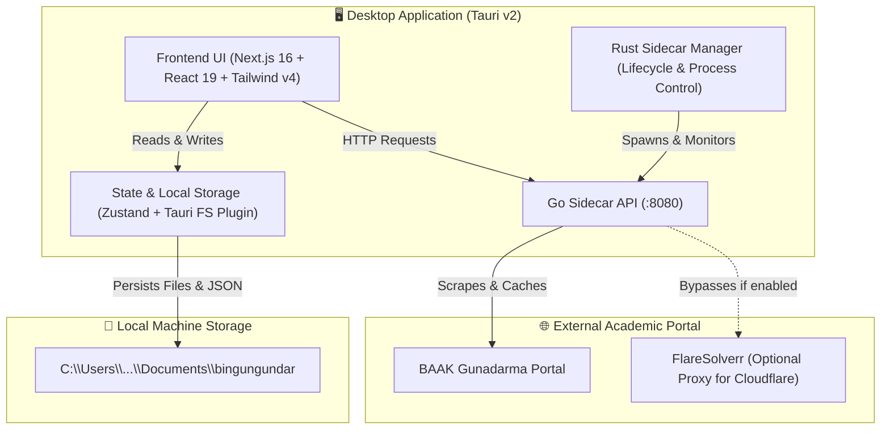

<div align="center">

# 🎓 bingungundar

**The Modern All-in-One Desktop Companion & Academic Dashboard for Universitas Gunadarma Students**

[](https://tauri.app/)
[](https://nextjs.org/)
[](https://react.dev/)
[](https://golang.org/)
[](https://tailwindcss.com/)
[](LICENSE)

<br />

> Solusi terpadu untuk mahasiswa Gunadarma yang lelah dengan navigasi BAAK yang lambat. Pantau jadwal kuliah, jadwal ujian (UTS), presensi, tugas, serta simpan materi & catatan kuliah langsung di laptop secara offline-first dan privat.

</div>

---

## 💡 Mengapa bingungundar?

Situs portal akademik kampus seringkali lambat, sulit diakses saat *peak hours*, atau membutuhkan navigasi berulang hanya untuk mengecek jadwal harian dan ruang kelas. 

**bingungundar** hadir sebagai aplikasi desktop modern yang:
1. **Instan & Ter-cache**: Menggunakan arsitektur sidecar berkecepatan tinggi dengan *in-memory caching*, sehingga jadwal dapat dibuka dalam **0 detik** tanpa membebani server BAAK.
2. **100% Offline-First & Privat**: Tidak ada akun server eksternal, tidak ada database cloud pihak ketiga. Semua catatan, materi, dan data profil disimpan murni di direktori dokumen lokal komputer Anda.
3. **Produktif & Terintegrasi**: Menggabungkan manajemen perkuliahan harian (jadwal kelas, UTS, absensi, tugas) dengan penyimpanan materi yang terhubung langsung ke File Explorer sistem operasi.

---

## ✨ Fitur Utama

### 📅 1. Jadwal Kuliah Cepat & Caching 12 Jam
- Ambil jadwal resmi perkuliahan per kelas (misal: `1KA02`, `3IA01`, dll) langsung dari BAAK.
- Dilengkapi sistem *in-memory cache* cerdas — jadwal yang sudah pernah diambil akan terbuka instan dalam hitungan milidetik.
- Highlight jadwal hari ini, waktu mulai-selesai, ruang kelas, dan dosen pengampu.

### 📝 2. Jadwal Ujian Tengah Semester (UTS)
- Pencarian jadwal UTS otomatis berdasarkan kelas mahasiswa.
- Dilengkapi mekanisme fallback caching untuk mengantisipasi saat situs BAAK sedang down/overload.

### 📊 3. Attendance Tracker & Kalkulator Presensi
- Catat riwayat kehadiran tiap mata kuliah: **Hadir**, **Izin**, **Sakit**, atau **Alpha**.
- Kalkulasi otomatis persentase kehadiran untuk memastikan Anda tetap memenuhi syarat minimum mengikuti ujian akhir.

### 📋 4. Task & Assignment Management (To-Do List)
- Manajemen tugas kuliah dengan status terstruktur (*To Do*, *In Progress*, *Done*).
- Dilengkapi penanda deadline dan relasi mata kuliah agar tidak ada tugas yang terlewat.

### 📁 5. Catatan & Materi Kuliah dengan File Preview Langsung
- Simpan dokumen materi kuliah dan catatan per mata kuliah langsung ke sistem file lokal (`Documents/bingungundar/`).
- **In-App File Preview**: Langsung pratinjau dokumen tanpa membuka aplikasi lain (mendukung file Word `.docx` via Mammoth, PDF, Gambar, dan File Teks).
- Tombol **"Buka di File Explorer"** / **"Reveal Item"** untuk langsung melompat ke folder penyimpanan asli di Windows Explorer.

### 🎨 6. Modern Dark-Themed UI
- Antarmuka modern, responsif, dan elegan menggunakan Tailwind CSS v4, Lucide Icons, dan komponen berbasis Shadcn/UI.

---

## 🏛 Arsitektur Sistem

Aplikasi ini menggabungkan ekosistem **Tauri v2 (Rust)**, **Next.js 16 (React 19)**, dan **Go Sidecar**:



- **Frontend**: Next.js App Router dengan Static Site Generation (`output: 'export'`) yang dimuat secara native ke dalam jendela webview Tauri.
- **Backend Sidecar**: Binary Go mandiri yang dijalankan dan dikelola otomatis oleh runtime Rust Tauri saat aplikasi dibuka, lalu dimatikan secara bersih (*graceful shutdown*) saat aplikasi ditutup.
- **Local Storage Engine**: Adapter ganda yang mengutamakan `@tauri-apps/plugin-fs` untuk menyimpan data di direktori dokumen sistem operasi, dengan fallback `IndexedDB`.

---

## 🛠 Tech Stack

| Layer | Teknologi | Deskripsi |
|---|---|---|
| **Desktop Shell** | [Tauri v2](https://tauri.app/) (Rust) | Native windowing, low RAM footprint, IPC & OS File System Plugins |
| **Frontend Framework** | [Next.js 16](https://nextjs.org/) + [React 19](https://react.dev/) | React Server Components & Static Site Export |
| **Styling** | [Tailwind CSS v4](https://tailwindcss.com/) | Modern OKLCH color spaces, responsive design, dark mode |
| **State Management** | [Zustand v5](https://github.com/pmndrs/zustand) | Client-side persistent reactive state |
| **Data Fetching** | [SWR](https://swr.vercel.app/) | Stale-while-revalidate data synchronization |
| **File Parser** | [Mammoth.js](https://github.com/mwilliamson/mammoth.js) | In-app Word document (.docx) to HTML previewer |
| **Scraper API** | [Go (Golang)](https://golang.org/) | Concurrent HTTP scraper, HTML parsing (GoQuery), in-memory TTL caching |
| **Icons** | [Lucide React](https://lucide.dev/) | Consistent & clean UI iconography |

---

## 🔒 Keamanan & Privasi (Privacy by Design)

- **Tidak Ada Data Cloud**: Aplikasi ini tidak menggunakan cloud database, analytics tracker, maupun server analitik pihak ketiga.
- **Data Tersimpan Lokal**: Data nama, NPM, presensi, catatan, dan tugas disimpan sepenuhnya di laptop pengguna.
- **Zero Credential Leaks**: Tidak memerlukan penyimpanan password atau credential rahasia di server luar.

---

## 🚀 Memulai (Local Development & Setup)

### Prasyarat
Pastikan komputer Anda sudah terinstal:
- [Node.js](https://nodejs.org/) (versi 20 atau lebih baru) & [pnpm](https://pnpm.io/)
- [Rust & Cargo](https://rustup.rs/) (versi 1.77+)
- [Go](https://go.dev/) (versi 1.22+, hanya jika ingin mengompilasi ulang scraper API)
- [C++ Build Tools / Visual Studio Community](https://visualstudio.microsoft.com/downloads/) (untuk Windows MSI/NSIS build)

### 1. Clone Repository
```bash
git clone https://github.com/username/bingungundar.git
cd bingungundar
```

### 2. Instal Dependensi Frontend
```bash
pnpm install
```

### 3. Jalankan Mode Development (Next.js + Tauri)
```bash
pnpm tauri dev
```
Perintah ini akan secara otomatis:
1. Menjalankan server dev Next.js di `http://localhost:3000`.
2. Menjalankan sidecar Go `baak-api` di latar belakang.
3. Membuka jendela desktop aplikasi Tauri.

### 4. Build Production Installer (Windows .exe / .msi)
```bash
pnpm tauri build
```
Installer biner siap pakai akan dibuat di folder `src-tauri/target/release/bundle/nsis/`.

---

## 📂 Struktur Direktori

```text
bingungundar/
├── baak-api/              # Go backend service (Scraper BAAK & Caching engine)
│   ├── config/            # Konfigurasi port, cache TTL, & base URL
│   ├── handlers/          # HTTP handler untuk jadwal, UTS, & kalender
│   ├── models/            # Struktur data Golang
│   └── utils/             # Scraper logic, GoQuery parser, circuit breaker
├── src-tauri/             # Tauri v2 Desktop Core (Rust)
│   ├── binaries/          # Prebuilt binary sidecar untuk Windows
│   ├── icons/             # Icon aplikasi multi-resolusi
│   ├── src/               # Rust entry point (lib.rs & main.rs)
│   └── tauri.conf.json    # Konfigurasi jendela & permissions Tauri
├── src/
│   ├── app/               # Next.js App Router (Halaman dashboard, jadwal, presensi, materi, catatan)
│   ├── components/        # Komponen UI (Sidebar, Dialogs, File Previewer, UI Kit)
│   ├── hooks/             # Custom React hooks
│   ├── lib/               # Storage adapters (Tauri FS & IndexedDB), API fetchers
│   └── store/             # Zustand stores (useAcademicStore, useProfileStore, useTaskStore)
├── public/                # Asset statis, ilustrasi, & logo aplikasi
├── package.json
└── README.md
```

---

## 📄 Lisensi

Didistribusikan di bawah Lisensi MIT. Lihat [`LICENSE`](LICENSE) untuk informasi lebih lanjut.

---

<div align="center">
Dibuat oleh <b>Akmal Ghanim</b> untuk mahasiswa Universitas Gunadarma.
</div>
